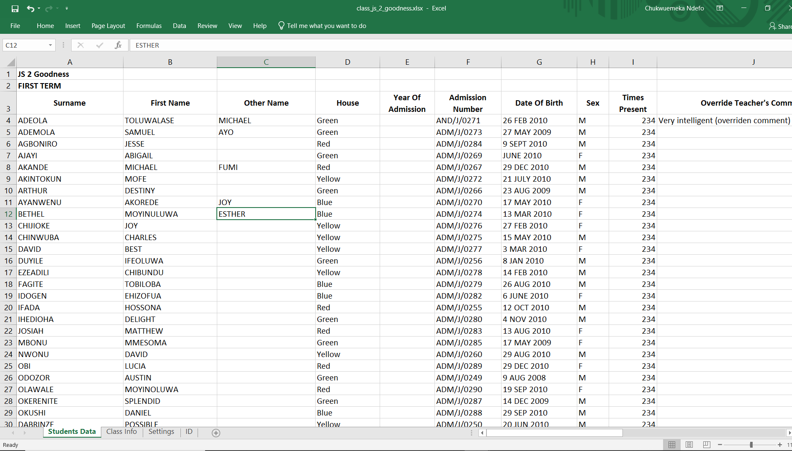
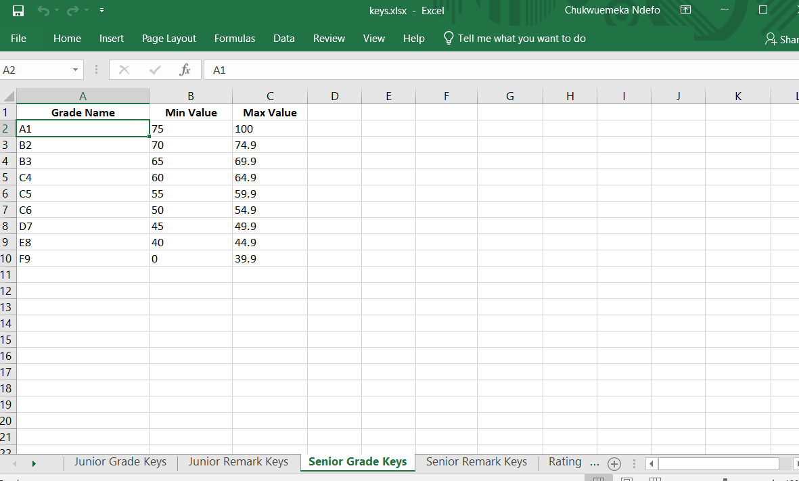
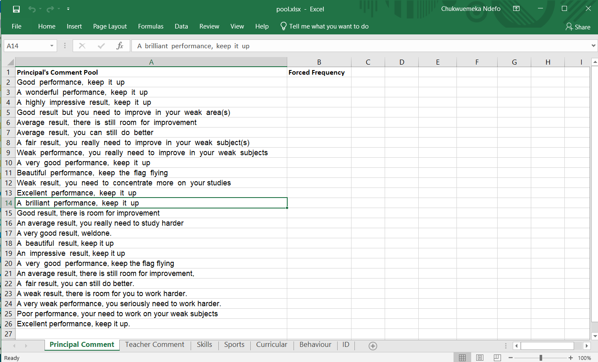
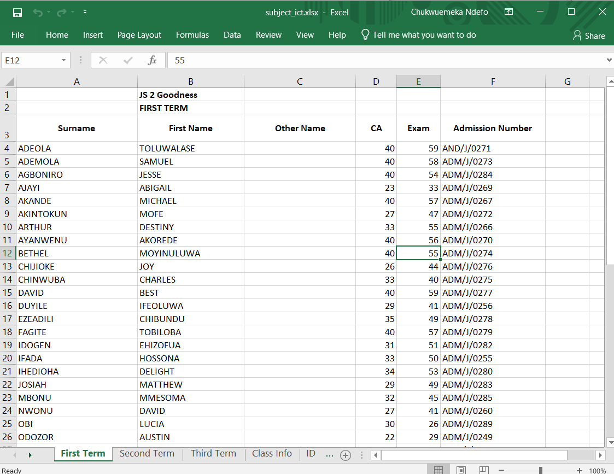
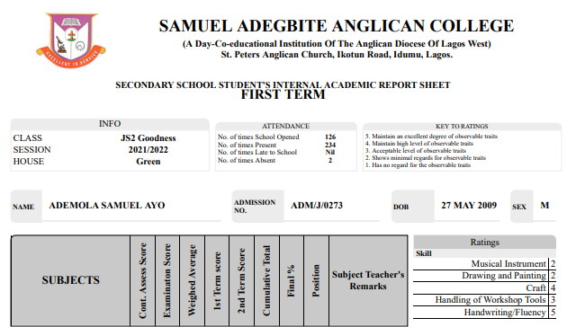

# Smart Result

Smart Results (SAAC Hub) is a web application which runs on any computer to accept excel 
files with students’ information, and generate the needed students results as printable PDF 
files, in A4 paper sizes.

This app can improve on the result generation system of a school, and as well eliminate 
almost all the bottlenecks inherent in the manual paper-works in use. The app perfectly passed 
the test of generating results for 50 students offering 20 subjects for 3 terms (first, second, 
and third), in just 4 minutes, with modern design including logo and students’ photos.

# Install

```yarn install```


```cd smartapi```

```node init```

# Usage

```yarn start```


The App is launched at port 8880.

Node backend runs at port 8881.

[View Smart Result](http://localhost:8880/)


> :bangbang:Note that the data included in this app is for demonstration purposes only, and doesn't represent the students' performance in any way


## Simple Steps:


1. Download the Templates

2. Fill them with the desired data

3. Zip them as one file

4. Upload the file to generate the results

5. Download the Results, for all the included Terms

> See a [sample of Prefilled templates](demo_files/junior%20class%20(50%20students)%20_3%20terms%2020subjects.rar) in the demo_files directory.

## Templates Documentation

#### General
> There are 4 types: Students, Subjects, Keys, and Pool. Only Subjects template can be included more than one file; that is, for each subject.

#### Specifics
> **Students template** defines all the data about the students and the class. This file must not be more than 1.



> **Keys template** specifies the Grade names and corresponding values for both Junior and Senior schools. This file must not be more than 1.



> **Pools template** includes the Principal's and Teacher's comments allowable texts, and skills grading for curricular activities too. This file must not be more than 1.



> **Subjects templates** supply the continous assessments and exam records of the students for first, second, and third terms. Only results for the terms marked acive will be generated. This file is usually the number of subjects for that class.




#### Images / Avatars
> Only one directory is included, specially for keeping students photos, which will be displayed on their results. The school logo is auto detected at the root of the zipped file. If no image is found for a student, a corresponding gender avatar is used instead.


#### UI Customization
> The app uses custom templates (3 types included). This has endless possibility of creating unlimited designs.



#### Result
> The students results is downloaded as a single zipped file.


# Project Info

**Initiated Date:** 25th November, 2021

**Completed Date:** 23rd February, 2022.

**Duration:** 3 months.

**Updates:** The next update will include database integration, and real-time result computation.

